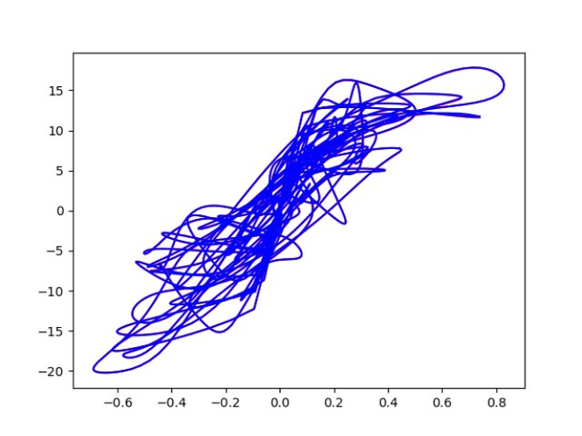
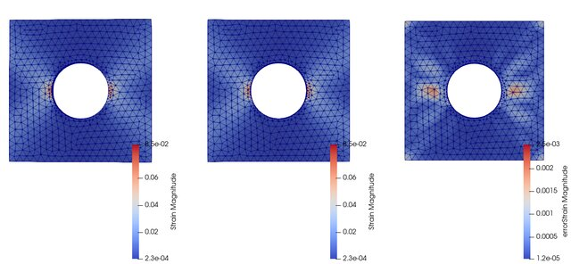

Presentation of my internship work on neural network constitutive law during the MFront-User days.

MFront-User days are events dedicated to users of the [MFront](https://thelfer.github.io/tfel/web/index.html) developed at the CEA of constitutive modeling.

## Abstract

The characterization of the material behavior is crucial in the resolution of mechanical problems. For decades, constitutive laws were built thanks to parametric models depending on theoretical formalism [@truesdell_2004]. Identifying those parameters and fitting the data is one of the major difficulties. Therefore, modelling error and uncertainty arise from an imperfect knowledge of the functional form of the material laws. More recently, different kind of data-driven models were introduced with the use of AI, more specifically neural networks [@mehdi_pouragha_2020], or by a minimization problem in the phase space [@kirchdoerfer_ortiz_2016]. In the first case, neural networks allow to easily fit the material behavior without strong mathematical a priori. Moreover, it has been proved that feedforward neural networks are universal approximators [@hornik_1989], thus they could characterize complex material behaviors. This talk presents different neural network based constitutive models instead of traditional constitutive law formulations. Neural networks enable to fit the material behavior with an expressive class of functions. The neural network models are directly trained on a synthetic dataset of random load tests in order to find a suitable representation of the material behavior. We introduce different neural network architectures for constitutive modelling. First, we consider a feedforward network in order to approximate a parametric nonlinear elastic model Ramberg Osgood. Then, in order to cope with history-dependent materials, we consider a recurrent neural network (GRU cells) to model a von Mises elasto-plastic behavior with isotropic linear hardening Isotropic Hardening. Finally, we demonstrate how to fit a model with PyTorch, integrate it in MFront, and perform finite elements simulations thanks to the mgis.fenics python library. We benckmark machine learning models with classical formulations based on the results of such simulations.


*($$\varepsilon_{xx} , \sigma_{xx}$$) projection. Reference solution in red perfectly overlayed by the model prediction in blue.*


*Reference solution (left), model prediction (center), error representation of the strain eld (right).*

Extract from MFront files :
```cpp
@Include{
    struct NN{
        ...
        torch::jit::script::Module module; // Neural Network
        ...
        inline std::pair<tfel::math::stensor<3u, double>, tfel::math::st2tost2<3u, double>>
        operator()(const tfel::math::stensor<3u, double> &strain)
        {
            std::vector<torch::jit::IValue> inputs; // Initialize the Torch 
            inputsmfront2pytorchInputs(strain, inputs); // Convert tfel tensor to Torch
            auto outputs = module.forward(inputs).toTuple(); // Forward evaluation of the model
            torch::Tensor torchStress = outputs->elements()[0].toTensor(); // Stress
            torch::Tensor torchTangentOperator = outputs->elements()[1].toTensor(); // Tangent op.
            // Convert Torch tensors to tfel tensors
            tfel::math::stensor<3u, double> stress;tfel::math::st2tost2<3u, double> tangentOperator;pytorchOutputs2mfront(torchStress, torchTangentOperator, stress, tangentOperator);return {stress, tangentOperator}}}} 
```

